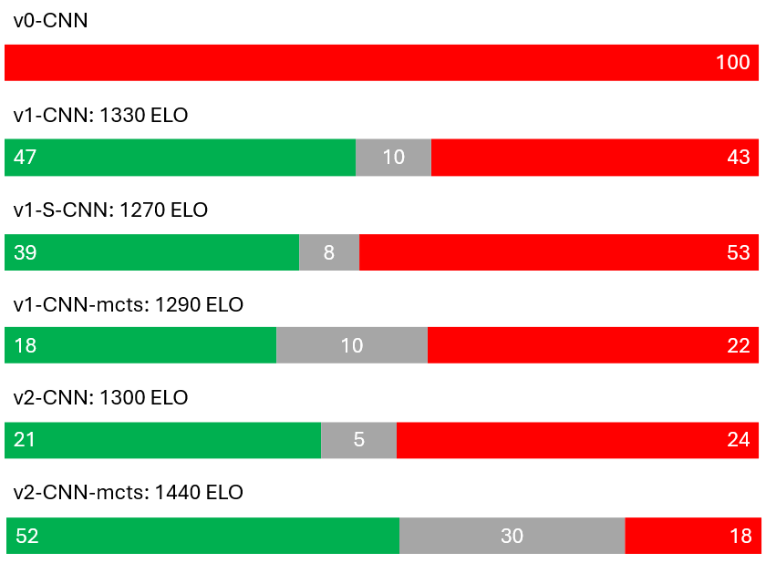

# Chess-AI

A machine learning model trained on data from my own online chess games on [Chess.com](https://www.chess.com/home). The resulting neural network (policy + value heads), is optionally guided by Monte Carlo Tree Search (MCTS) and should play similar moves to me.

Game data was downloaded in PGN format from https://www.openingtree.com/. To train your own model using this framework, download your PGN games from the link and place them in the /games folder.

I have also integrated the resulting model into my C++ [Chess](https://github.com/jordi-lete/Chess) application. At the time of writing, this is contained within a separate `PvAI` branch of that repository.

---

## How the Model Was Trained

The original approach was pure behavioral cloning on my own ~8,000 games. This hit a hard ceiling fast:

While the model performed well and in the same style as me up to around move 15, my personal game database is relatively small, it contains my own blunders >.< (especially mid/endgame), and there simply isn't enough data to keep up with the exponentially growing number of positions the model can encounter in the middle and end game.

I moved to a staged training pipeline instead, where each phase has a distinct job:

### Phase 1 — Supervised Learning
**Goal:** build genuine chess competence before worrying about style at all.

The model (a ResNet with 19 residual blocks, 256 channels, with separate policy and value heads) was trained on a large dataset combining:
- ~6.8M positions from Lichess games (rating-filtered to 1600–1900, roughly my own online rating)
- ~256k positions from my own personal games
- ~463k positions from the Lichess tactical puzzle database (puzzle solutions only — the opponent's forced lead-in moves are excluded)

This gives a baseline model that already understands openings, tactics, and basic strategy, rather than just imitating my own moves.

### Phase 2 — Reinforcement Learning
**Goal:** push playing strength beyond what supervised learning on human games can reach.

This phase uses AlphaZero-style self-play with MCTS: the model plays games against itself (and periodically against Stockfish at an adaptive rating), and is trained so its policy head matches the move distribution MCTS search actually preferred, while its value head is trained against real game outcomes. A frozen copy of the Phase 1 model is kept as a KL-divergence anchor, so the model can't drift away from the chess knowledge it already learned and "forget" how to play.

This was the hardest phase to get right — see [Iteration History](#iteration-history) below for the bugs that came up and how they were diagnosed.

### Phase 3 — Style Fine-tuning
**Goal:** shift the model's move *preferences* toward my own style, without losing the strength gained in Phases 1–2.

Starting from the strongest RL checkpoint, the ResNet body is frozen and only the policy head is fine-tuned, training on a mix of my own personal games (majority) and Lichess data (minority, to prevent the model from overfitting and forgetting general chess knowledge). This is deliberately done *last* — fine-tuning on a stronger base model preserves more underlying strength, and the fine-tune itself is cheap (~10 epochs), so it's easy to redo if an earlier RL checkpoint needs revisiting.

### Phase 4 — Opening Book (Optional)
**Goal:** guarantee my actual opening repertoire is reproduced exactly, rather than left to chance.

A deterministic, frequency-weighted lookup table is built directly from my PGNs (with a minimum-occurrence threshold to filter out one-off blunders/anomalies). This is used only at inference time — it's never part of training — and is checked first, with the neural network as fallback once the game leaves my known book. I will ideally skip this step if phase 3 fine tuning works well.

### Deployment
The final model is exported via `torch.jit.trace` to TorchScript and loaded by the C++ GUI via LibTorch, with the opening book consulted first and the network used for everything afterward.

---

## Iteration History

This is a rough log of how playing strength evolved across versions, including the bugs that caused regressions along the way. ELO is estimated via the standard logistic formula against the stated Stockfish opponent.

| Model | Description | Score vs Stockfish (1320) | Est. ELO |
|---|---|---|---|
| v0-CNN | Original 3-layer CNN, personal games only (~200k positions) | 0W / 0D / 100L | n/a |
| v1-CNN | Phase 1 SL, 7.5M positions, raw policy (no search) | 47W / 10D / 43L | ~1330 |
| v1-S-CNN | v1 + early style fine-tune (attempted before RL) | 39W / 8D / 53L | ~1270 |
| v1-CNN-mcts | v1-CNN + 500-sim MCTS | 18W / 10D / 22L | ~1290 (worse than raw policy) |
| v2-CNN | v1-CNN + value head recalibrated against Stockfish evals | 21W / 5D / 24L | ~1300 (within noise of v1) |
| v2-CNN-mcts | v2-CNN + 500-sim MCTS | 52W / 30D / 18L | **~1440** |


<p align="center">
    
</p>

A few notable things that happened along the way:

- **The early style fine-tune made the model weaker, not stronger.** Fine-tuning straight onto the Phase 1 checkpoint dropped strength from ~1330–1370 to ~1140–1270, since my own move preferences aren't always the objectively strongest move. This is why style fine-tuning was pushed to Phase 3, after RL.
- **MCTS initially made the model *worse* than raw policy** (v1-CNN-mcts scored lower than v1-CNN). The value head needed its own recalibration before MCTS could help. It was trained only on binary win/loss outcomes, which gave the right *sign* (~90%+ accuracy) but not the right *magnitude* — not precise enough for MCTS to judge which lines were worth searching deeper. Fine-tuning just the value head against Stockfish's own evaluations (depth 10) fixed this, and is what finally let MCTS clearly outperform raw policy (v2-CNN-mcts).
- **An early attempt at RL without a KL-divergence anchor caused catastrophic forgetting.** After ~15 self-play iterations, the model's score against Stockfish collapsed from 52% to ~2%, having overwritten its supervised-learning knowledge (including its openings) with noisy self-play targets. Restoring a frozen reference model and a KL penalty fixed this.

**Current status:** RL training is ongoing from the `v2-CNN` checkpoint, targeting ~1700–1800 ELO. Progress is tracked via periodic Stockfish benchmark games (trend over many iterations, since variance is high game-to-game) plus a raw-policy-only canary every 10 iterations to catch silent policy regressions early.

---

## Architecture

**Model:** `ResNetChessModel` — a ResNet with 19 residual blocks, 256 channels, two heads:
- **Policy head:** Conv → BatchNorm → ReLU → Flatten → Linear → 4,672 logits
- **Value head:** Conv → BatchNorm → ReLU → Flatten → Linear → ReLU → Linear → Tanh → scalar in [-1, 1]

**Board representation:** an 18×8×8 tensor, encoded from the *current player's* perspective (not absolute White/Black):
- Channels 0–5: current player's pieces (P, N, B, R, Q, K)
- Channels 6–11: opponent's pieces
- Channels 12–13: current player's castling rights (kingside/queenside)
- Channels 14–15: opponent's castling rights (kingside/queenside)
- Channel 16: en-passant target square
- Channel 17: check indicator (1 if the side to move is in check)

**Policy encoding (4,672 total):**
- Indices 0–4,095: `from_square * 64 + to_square` — all normal moves and queen promotions
- Indices 4,096–4,287: knight underpromotions
- Indices 4,288–4,479: bishop underpromotions
- Indices 4,480–4,671: rook underpromotions

This matches the encoding mirrored in the C++ inference engine (`Model::moveToPolicyIndex`).

---

## Setup Instructions

### 1. Clone the Repository
```bash
git clone https://github.com/jordi-lete/Chess-AI.git
cd Chess-AI
```

### 2. Create a virtual environment (Recommended)
I am using Python 3.13.3.
```bash
python -m venv venv
```
On Windows:
```bash
venv\Scripts\activate.ps1 # Powershell
venv\Scripts\activate.bat # Bash
```
On Linux:
```bash
source venv/bin/activate
```

### 3. Install requirements
```bash
pip install -r requirements.txt
```

You'll also need a **Stockfish** binary on your system for Phase 2 (RL) and for benchmarking — it's used both as a sparring partner mixed into self-play and as the fixed opponent for ELO estimates. Download it from the [official Stockfish site](https://stockfishchess.org/download/) and update the path in `stockfish_utils.py` to point to your binary.

### 4. Download your chess games
To download your personal games, go to: https://www.openingtree.com/. Place the resulting PGN files into the `/games` folder.

I also downloaded a month of games from the Lichess database: https://database.lichess.org/, filtered to the 1600–1900 rating range to roughly match my online rating, giving around 7.5M total positions to train on.

### 5. Phase 1 — Supervised Learning
Run the `train.ipynb` Jupyter Notebook, editing the filepath for the games to your PGN files. This produces the base checkpoint that the rest of the pipeline builds on.

### 6. Phase 2 — Reinforcement Learning
This phase uses self-play + MCTS to push strength beyond what Phase 1 alone can reach.

1. **Calibrate the value head first.** Run `value_calibration.py`, which samples positions from your Lichess data, annotates them with Stockfish evaluations, and fine-tunes only the value head against them. This step matters — without it, MCTS search will underperform raw policy.
2. **Run self-play training.** Use the RL training script (see `RL_utils.py` and `replay_buffer.py`) to generate self-play games via `mcts.py`, mixed with a smaller number of games against Stockfish at an adaptive rating. Each iteration's games feed into the replay buffer used for the next training step.
3. **Monitor progress, don't trust single iterations.** Self-play win rate against Stockfish is noisy game-to-game — track the trend over many iterations rather than any single iteration's score. It's also worth running a periodic raw-policy-only benchmark (no MCTS) every several iterations as an early-warning check, since RL can silently degrade the underlying policy even while MCTS-assisted play looks fine.
4. Keep a **frozen reference copy** of the model you started RL from — this is used as a KL-divergence anchor during training to stop the model from drifting away from what it learned in Phase 1.

Key hyperparameters to set (see `RL_utils.py`): self-play games per iteration, MCTS simulation count, temperature schedule, KL-divergence weight, and value-loss weight. Expect to tune these based on how your Stockfish benchmark trends.

### 7. Phase 3 — Style Fine-tuning
Once RL has plateaued (or you're satisfied with the strength), freeze the ResNet body and fine-tune only the policy head on a mix of your personal games (majority) and general Lichess data (minority — this prevents the model from overfitting too narrowly to your own games and forgetting general chess knowledge). Check your Stockfish benchmark afterward; a small ELO drop (~50) is expected and fine, but a larger one suggests increasing the Lichess proportion in the mix.

### 8. Phase 4 — Opening Book
Build the frequency-weighted opening book directly from your PGNs, with a minimum-occurrence threshold to filter out one-off games/blunders. This is used purely at inference time and isn't part of training.

### 9. Test the model
Run the `predict.ipynb` Jupyter Notebook, editing the model name to whichever checkpoint you want to test (raw policy, MCTS-assisted, or with the opening book layered on top).

### 10. Export for the C++ engine
Export the final model via `torch.jit.trace` to TorchScript so it can be loaded by the C++ GUI through LibTorch (see `Model.cpp` / `Model.h` in the [Chess](https://github.com/jordi-lete/Chess) repo's `PvAI` branch).

> **Note for Windows/LibTorch users:** Debug builds must link against the `/MD` runtime (not `/MDd`) with `_ITERATOR_DEBUG_LEVEL=0` to match LibTorch's release-mode ABI — otherwise every call into LibTorch will throw `c10::Error`.
